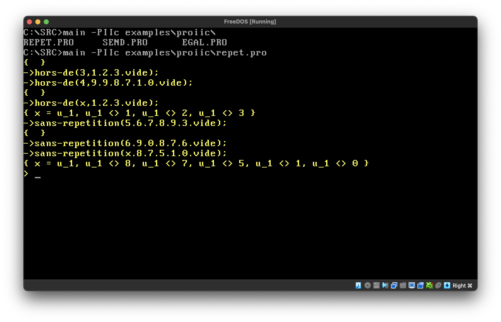
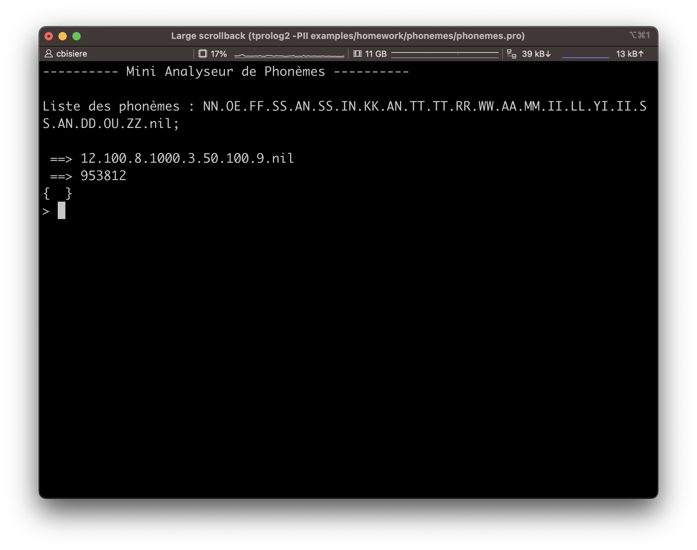
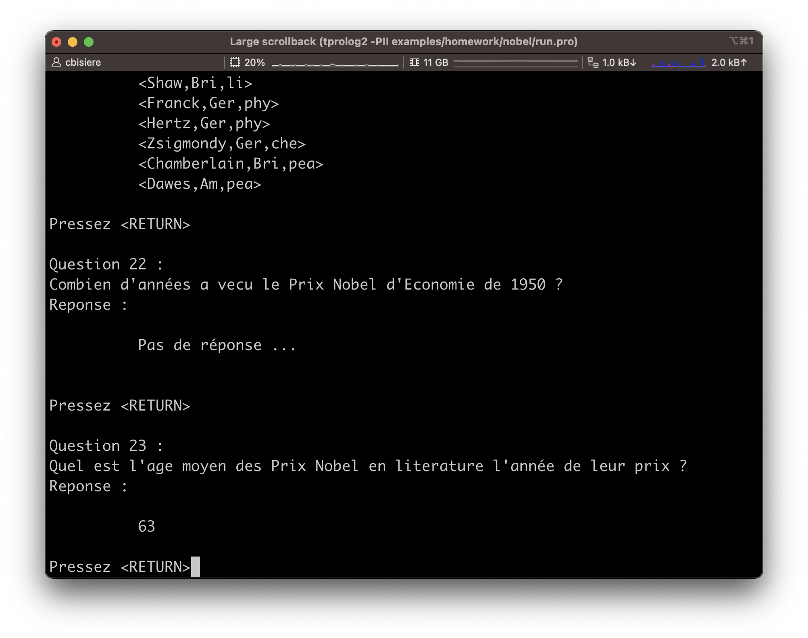
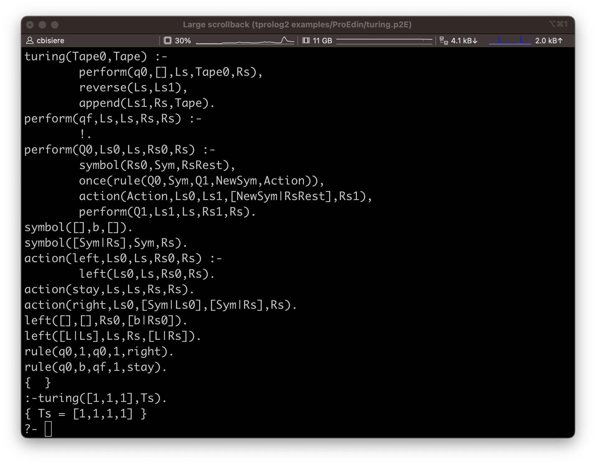

# A Simple Prolog II Interpreter 
A simple Prolog II interpreter written in Pascal

## What?

This is a simple Prolog interpreter, for Linux, macOS, and Windows. It compiles under Turbo Pascal 4 and Free Pascal.

Regarding syntax, it (almost fully) handles the following flavours of the language: Prolog II (version 1 and version 2), Prolog II+ and Prolog Edinburgh.

This whole programme started as an academic exercice, without any consideration for efficiency. In particular, memory consumption is high. Nonetheless, the interpreter is able to solve the "send more money" classical exercice in a low-end computer.

## Why?
2022 was [the 50th anniversary of Prolog](http://prologyear.logicprogramming.org/). As a modest tribute for this anniversary, I decided to dig up a Prolog interpreter I wrote almost 35 years ago, clean it a bit, add a few missing features (e.g., cut, freeze, garbage collection), and push it online. As this program remains a toy program, this serves no real purpose other than to celebrate this anniversary. 

Nonetheless, if you are old enough to have some old Prolog II programs stored in an old backup unit, you may use the interpreter to run them. Please report a bug if something does not work.  

I wrote this interpreter as a course assignment, back in 1988, when I was a student at the University of Aix-Marseille II, pursuing a MSc in Computer Science and Mathematics ("Diplôme d'Études Approfondies en Informatique et Mathématique"). The course, entitled "Prolog II", was taught by the late [Alain Colmerauer](https://en.wikipedia.org/wiki/Alain_Colmerauer), creator of the Prolog language. The assignment was to create a Prolog II interpreter, without any predefined predicates, but capable of running some basic Prolog programs such as repetition, permutation, as well as the traditional "menu" or "send more money" examples.

One of the courses I also took in this MSc was Henri Méloni's course on speech recognition. As my Prolog II interpreter gained additional features, executing the Prolog II programs I wrote for this course is now possible. Ditto for a Prolog program to query a database of Nobel Prize winners.

A more ambitious goal is to run some of the demo programs written by Alain Colmeraurer (see [Alain Colmerauer's website](http://alain.colmerauer.free.fr/)). At this point, the interpreter is able to read the entire Orbis program, but fails to run it as many built-in predicates have not been implemented yet.

## Status

*As of May 2024:*

Support for Prolog II (both versions) and Prolog II+ (both Marseille and Edinburgh) syntaxes is (I believe) complete.

The interpreter offers (partial) support for UTF-8 input and output. 

Support for Prolog II's predefined predicates is almost complete, and should be completed soon. Prolog II+ has a much larger set of predefined predicates. Only the bare minimum will be implemented, so as to run some examples I found interesting. The module system will not be implemented.

## Overview
Being a simple implementation exercice, the interpreter offers only a few [built-in predicates](PREDEF.md) and no advanced features. 

Nonetheless, the interpreter is fully garbage collected and has almost no hard-coded limits, thanks to its garbage collector and dynamic string manager.

The source code contains detailed comments about the implementation (parsing and execution).

### Lists
In Marseille syntax, a dot `.` is used to separate items in a list. For instance, the rules defining the insertion of an element before any item in a list could be written as:

```
insertion(e,x,e.x) ->;
insertion(e,f.x,f.y) -> insertion(e,x,y);
```

Note that variable names (e.g., `e`) start with a single letter, while identifiers (e.g., `insertion` start with at least two letters. Names and identifiers can have any length.

Inserting an element in a list of four items gives three different solutions:

```
-> insertion(0,1.2.nil,x);
{ x=0.1.2.nil }
{ x=1.0.2.nil }
{ x=1.2.0.nil }
```

Edinburgh-style lists are also supported. In PrologII+ mode, both syntaxes can be mixed, and satisfy the five equivalences listed on page 45 of the Prolog II+ documentation, and an additional sixth listed in the French documentation on page 48:

```
$ ./tprolog2 -PIIp
+> eq([aa|bb],aa.bb);
{  }
+> eq([aa,bb],aa.bb.nil);
{  }
+> eq([aa,bb,cc,dd],aa.bb.cc.dd.nil);
{  }
+> eq([aa,bb,cc|dd],aa.bb.cc.dd);
{  }
+> eq([aa,bb|cc.dd.nil],aa.[bb,cc,dd]);
{  }
+> eq([],nil);
{  }
+>
```

### Constraints

When running in Prolog II mode, the interpreter handles constraints on trees, expressed as equalities (`=`) or inequalities (`#`). 

For instance, one can write a simple `dif` rule as:

```
dif(x,y) ->, { x # y };
```

This comma looks weird when the rule's queue is empty, but this is part of the syntax described in Colmerauer (1982.)

Then, the following query gives no results, as there is no `x` satisfying the constraint:

```
-> dif(x,x);
```

while the following query displays the resulting constraints:  

```
-> dif(x,1);
{ x#1 }
```
In Prolog II+, constraints are not part of the syntax anymore. Instead, `dif` is implemented as a predefined predicate.

### Strings

Strings are used as values or as comments. They must be double quoted. Inside a string, a double-quote must be doubled as `""`. Backslash `\`is a continuation character. Comments can appear anywhere outside of rules. String can have any length.

Querying the program

```
"This is a comment"

"This is \
another one"

string("Hello, world!")->;
string("They say: ""hello, world!""")->;
string("Pro\
log")->;
```

with the goal `string(s) outml(s) fails;` gives

```
Hello, world!
They say: "hello, world!"
Prolog
```

The primitive `outml(s)` display the string `s` without the surrounding quotes. 

### The "cut"
As in standard Prolog, when a rule containing a cut (`/`) is used to execute a goal, the execution of this cut prunes the search tree, making the search engine forget the other ways of executing that goal.

To illustrate how the cut works, consider the following example, taken from the [Prolog II Reference Manual](https://www.prolog-heritage.org/en/m2.html), Section 2.1, page R2-2:


```
color(red) ->;
color(blue) ->;

size(big) ->;
size(small) ->;

choice1(x.y) -> color(x) size(y);
choice1("that's all") ->;

choice2(x.y) -> ! color(x) size(y);
choice2("that's all") ->;

choice3(x.y) -> color(x) ! size(y);
choice3("that's all") ->;

choice4(x.y) -> color(x) size(y) !;
choice4("that's all") ->;
```

The following executions show that what the engine forgets after executing a cut in a certain rule or query is all the rules having the same head, plus all the rules which could have been used to clear the terms between the start of the rule's body (or the start of the query) and the cut.


```
-> choice1(u);
{ u=red.big }
{ u=red.small }
{ u=blue.big }
{ u=blue.small }
{ u="that's all" }
-> choice2(u);
{ u=red.big }
{ u=red.small }
{ u=blue.big }
{ u=blue.small }
-> choice3(u);
{ u=red.big }
{ u=red.small }
-> choice4(u) ;
{ u=red.big }
-> choice1(u) !;
{ u=red.big }
```

### Freeze

The `freeze/2` built-in predicate delays the clearing of goals until some variables are bound:

```
plus(x,y,z) -> freeze(x,freeze(y,sum(x,y,z)));
sum(x,y,z) -> val(add(x,y),z);

-> plus(x,y,z) eq(x,1) eq(y,2);
{ x=1, y=2, z=3 }
```

Variables that are both free and frozen are displayed using a special notation showing the associated frozen term: 

```
-> freeze(x,out(1));
{ x?out(1) }
```

### Infinite trees

Infinite trees are not integrated in the unification engine yet, but can be displayed using the `*n` notation:

```
-> eq(x,ff(x)) outl(x);
ff(*1)
{ x=ff(x) }
-> eq(x,ff(y,x)) eq(y,gg(x,y)) outl(x) outl(y);
ff(gg(*2,*1),*1)
gg(ff(*2,*1),*1)
{ x=ff(y,x), y=gg(x,y) }
``` 

### Assignments

Identifiers can be assigned using the predicate `assign(i,t)`. The identifier `i` then becomes a global, "static" (it resists backtracking) variable, whose value is equal to the term `t`. It can be further reassigned to a different term. Its value can be read using the predicate `val(i,v)`. 

```
-> assign(file_name,"file.txt");
{  }
-> val(file_name,x);
{ x="file.txt" }
-> assign(file_name,"another_file.txt");
{  }
-> val(file_name,x);
{ x="another_file.txt" }
>
```
The value of a non assigned identifier is the identifier itself:

```
-> assign(un,1);
{  }
-> val(un,x) val(deux,y);
{ x=1, y=deux }
>
```

### Evaluable functions

Evaluable functions such as `add(x,y)`,`sub(x,y)`,`mul(x,y)`,`div(x,y)`, or `inf(x,y)` are recusivelly evaluated when they appear in the first argument of `val`. Arguments `x` and `y ` must evaluate to integer values.

```
-> val(add(123456789,1),x);
{ x=123456790 }
-> val(sub(9,10),x);
{ x=-1 }
-> val(div(100,9),x);
{ x=11 }
-> val(inf(10,9),x);
{ x=0 }
-> val(add(mul(2,add(3,4)),1000),x);
{ x=1014 }
>
```

### Operators

Unary operators `+`,`-` and binary operators `+`,`-`,`*`,`/`,`^`,`<`,`>`,`>=`,`=<` are supported in PrologII+ and Edinburgh modes. Internal representation can be shown as follows:  

```
-> eq(f(x,y),1'<'2);
{ f=inf, x=1, y=2 }
```
Additional operators are available in Edinburgh mode: `is`,`=`,`//`, the standard order of terms operators `@<`,`@>`,`@=<`,`@>=`, and the "Univ" operator `=..`.

The "Univ" operator matches a predicate and a list as follows:


```
:- foo(X,Y) =.. L.
{ L=[foo,X,Y] }
```

New operators can be declared using `op/3` and `op/4` (see PrologII+ documentation page 137).

## Compilation

### Turbo Pascal

The program was initially developed in [Turbo Pascal 3](https://en.wikipedia.org/wiki/Turbo_Pascal#Version_3) (TP3). Turbo Pascal 3.02A is [provided](https://web.archive.org/web/20101124092418/http://edn.embarcadero.com/article/20792) to the Borland community free of charge, as a [zip file](https://web.archive.org/web/20110815014726/http://altd.embarcadero.com/download/museum/tp302.zip).

I initially tried to maintain compatibility with TP3. So, no classes, and a few restrictions on the syntax (e.g., no type cast) or semantic (e.g., no lazy evaluation). Workarounds had to be implemented for the most annoying limitations, namely 16-bit integers and 255-char strings. 

However, as the program grew, TP3 started overflowing memory during compilation. Consequently, Turbo Pascal 4.0 compatibility is the current target. A math coprocessor is required, be it real or virtual.

To build the interpreter with TP4, uses:

```
C:\src> TPC /B /$N+ tprolog2
```
The `/$N+` directive specifies that a 8087 maths coprocessor is present and must be used. 

### Free Pascal Compiler

To compile the interpreter with the [Free Pascal Compiler](https://en.wikipedia.org/wiki/Free_Pascal) (FPC), compile `src/tprolog2 ` in Turbo Pascal mode:

```bash
$ fpc -Mtp -FE. src/tprolog2.pas
```

## Execution

A Prolog program to execute is a (UTF8 or ISO/IEC 8859-1) text file containing both program rules and queries. When using the default syntax, rules must be written using the Marseille syntax. Each query starts with an arrow `->`and ends with a semicolon `;`. The end of the text file, or, alternatively, an additional `;`, ends the program. Lines in the input file can have any length.

For instance, the file `examples/ProII/permu.pro` contains four rules and two queries:

```
permutation(nil,nil) ->;
permutation(e.x,z) -> permutation(x,y)
                      insertion(e,y,z);

insertion(e,x,e.x) ->;
insertion(e,f.x,f.y) -> insertion(e,x,y);

-> permutation(1.2.3.nil,x);
-> permutation(3.a.1.b.nil,2.4.c.d.nil);

```
(Note the `nil` has no special meaning in Prolog II. In this example, `nil` is just an identifier used as an end-of-list mark.)

To execute a program stored in a file `$file` use the command line `tprolog2 -$syntax $file` where `$syntax` is one of the four supported language flavours. When the `$syntax` parameter is omitted, the syntax is inferred from the file extension.  

Value of `$syntax` | File extension | Prompt | Prolog flavour (and main changes from earlier versions)
--- | --- | --- | ---
`PIIv1` | `.p2c` | `c>` | Prolog II version 1: old Marseille syntax with dashes in identifiers and `/` as cut symbol; identifiers of built-in predicates are written in French; rules with an optional constraint part
`PII`  | `.pro` | `>` | Prolog II version 2: identifiers of built-in predicates are written in English; a few more built-in predicates; this is the default syntax of our interpreter
`PIIp` | `.p2` | `+>` | Prolog II+: no more dashes in identifiers; operators
`E` | `.p2E`, `.pl` | `?-` | Prolog II+: Edinburgh syntax; Marseille-style lists still supported

For instance, to run the Prolog programme `permu.pro`, just do:

```
$ ./tprolog2 examples/ProII/permu.pro
-> permutation(1.2.3.nil,x);
{ x=1.2.3.nil }
{ x=2.1.3.nil }
{ x=2.3.1.nil }
{ x=1.3.2.nil }
{ x=3.1.2.nil }
{ x=3.2.1.nil }
-> permutation(3.a.1.b.nil,2.4.c.d.nil);
{ a=2, b=4, c=3, d=1 }
{ a=2, b=4, c=1, d=3 }
{ a=4, b=2, c=3, d=1 }
{ a=4, b=2, c=1, d=3 }
>
```

The final `>`is a prompt, inviting you to type in other queries to execute, e.g.:

```
> permutation(1.2.3.nil,3.x.y.nil);
{ x=1, y=2 }
{ x=2, y=1 }
>
```

Predefined commands include `list` to list the current user rules:

```
> list fail;
permutation(nil,nil) ->;
permutation(e.x,z) ->
        permutation(x,y)
        insertion(e,y,z);
insertion(e,x,e.x) ->;
insertion(e,f.x,f.y) ->
        insertion(e,x,y);
>
```

and `insert(f)` to insert rules and queries from a file with file path `f`. 

You can navigate into the history of previous queries using the up and down arrow keys.  

When you are done, use `quit` or hit `Ctrl+C` to quit the interpreter.

```
> quit;
Bye!
$
```

## Predefined predicates

Predefined predicates available in each of the supported syntaxes are listed on [that page](PREDEF.md).

## BNF Syntax

We describe the different syntaxes handled by the interpreter using [Extended  Backus–Naur form](https://en.wikipedia.org/wiki/Extended_Backus%E2%80%93Naur_form) notation.

### Base elements

All the syntax flavours accepted by the interpreter share the following definitions:

```
letter = "A"|...|"Z"|"a"|...|"z"|"À" ... "ß" - "×" | "à" ... "ÿ" - "÷" ;
digit = "0"|...|"9" ;
q = """ ;

digits = digit, {digit} ;
letters = letter, {letter} ;

integer = ["+" | "-"], digits ;

real-number = digits, ".", digits, ("E"|"e"|"D"|"d"), [ ["+"|"-"], digits ];

string = q, { (character - q - newline) | (q, q) | ("\", newline) }, q ;

constant = identifier | integer | real-number | string ;
```
Note that using an explicit exponent for real numbers is mandatory, to avoid ambiguities with dotted lists. For convenience, it will be considered as optional in Edinburgh syntax, though.

### Marseille syntax

Both Prolog II and Prolog II+ are based on the so-called "Marseille syntax", featuring the famous `->` symbol for rules, `/` for cut, dotted lists, and tuples. Expressions in syntaxes without operators (i.e., Prolog II), as shown below, is just a term.

```
cut = "/" ;

expr = term

term = pterm, [".", term] ;

term-list = term, [",", term-list] ;

pterm = constant |
        (variable | identifier), ["(", term-list, ")"] |
        "<", [term-list], ">" |
        "(", expr, ")" ;       

rule = pterm, "->", { pterm | cut }, ";" ;

query = "->", { pterm | cut }, ";" ;                                

comment = string ;

program = { comment | rule | query }, [";"] ;

```
A `pterm` is a term that can appear at the highest level, that is, as a goal in a rule or query's body. Dotted lists cannot appear at this highest level.


### Prolog II

The "old" Prolog II syntax uses Marseille syntax, allowing for dashes in identifiers. 

Unsurprisingly, this possibility had to be reversed in a later version, called Prolog II+, to allows for arithmetic expressions. For instance, `x1-y2` is a valid name for a _single_ variable in Prolog II, which would create ambiguities if arithmetic expressions were to be allowed. 

During my graduation year, in 1988, I believe I did all my Prolog programming homework using workstations that were available in a lab at the Groupe d'Intelligence Artificielle (G.I.A.), the research group that ran the graduation program. Some SunOS workstations, maybe.

To be able to run the Prolog programs I wrote during the academic year, the Tiny Prolog interpreter must fully support the Prolog II syntax.

As mentioned, the most peculiar part of the Prolog II syntax concerns variable names and identifiers. Variables start with a single letter, while identifiers start with at least two letters. 

It also must be noted that even if the two books listed above define letters as 7-bit ASCII lowercase and uppercase letters only, one of the homework exercices I had to do (i.e., Nobel Prizes) happens to use dash-in-identifiers syntax (so, typical Prolog II) while some identifiers do contain accented characters. So I guess I used a version of Prolog II (predating II+) accepting accented letters. I am assuming that the set of letters in this hypothetical Prolog II version is the same as in Prolog II+.

```
variable = short-word, { "-", word } ;

identifier = long-word, { "-", word } ;

word = short-word | long-word ;

short-word = letter, { digit }, { "'" } ;

long-word = letter, word ;
```


As shown in Colmerauer (1982), Prolog II (version 1) accepts optional contraints to rules and queries:

```
constraint = term, ("=" | "#"), term ;          

system = "{", constraint, { ",", constraint }, "}" ;                         

rule = term, "->", { term | cut }, ["," system], ";" ;

query = "->", (term | cut) { term | cut }, [",", system], ";" ;
query = "->", [system], ";" ;

```
I allow it in Prolog II version 2 mode as well, for convenience.

### Prolog II+

Prolog II+ does not allow for dashes in variable names or (unquoted) identifiers. A single-quoted string (in which single quotes must be doubled) is an identifier. This allows for identifiers containing any characters, and is commonly used to define operators, e.g., `'>>'`. Additionally, identifiers can be made of graphic chars.
Variables start with a `_` or with a single letter. A variable whose name is `_` is anonymous. The cut becomes `!` instead of `/`, the former being reserved for calls to external procedures (a.k.a. _parasites_, e.g. `/?20001`). Tuples gain an alternative syntax: `<>(t1,...tn)`. Expressions are allowed, but cannot appear at the highest level. Finally, both dot and Edinburgh-style lists are supported in Prolog II+ mode, and can be mixed.

```
cut = "!" ;

alpha = letter | digit | "_" ;

graphic-char = "#" | "$" | "&" | "*" | "+" | "-" | "/" | ":" | "=" | 
    "?" | "\" | "@" | "^" | "~"| NBSP ... "¿" | "" | "÷" ;

graphic-identifier = graphic-char, { graphic-char }

variable = ("_" , { alpha }) | extended_var ;

extended_var = letter, [ (digit | "_"), { alpha } ] , { "'" } ;

sq = "'" ;

quoted-identifier = sq, { (character - sq - newline) | (sq, sq) | ("\", newline) }, sq ;

expr = [unary-op], term [binary-op, expr] ;

expr-list = expr, ["," , expr-list] | 

pterm = constant |
        (identifier | variable), ["(", term-list, ")"] |
        "<", [term-list], ">" |
        "<", ">", "(", term-list, ")" |
        "[", [list-expr], "]" |
        "(", expr, ")" ;       

list-expr = expr, ["," , list-expr] | 
            expr, "|", expr ;

```
where `graphic-identifier` and `quoted-identifier` are two additional forms of `identifier`.

### Edinburgh

Edinburgh syntax differs from Marseille syntax: 

* the arrow sign is `:-` (instead of `->`);
* facts do not end with an arrow;
* rules and facts end with a `.` (instead of `;`);
* variable names start with a `_` or with an uppercase letter;
* tuples must be written following the `<>(...)` syntax only;
* expressions are allowed at the highest level, that is, as rule head or as goal in rule queues or queries.

```
big-letter = "A"|...|"Z" ;

extended-var = big-letter, [ { alpha } ] ;

additional-graphic-char = ";" |"<" | ">" ;

rule = expr, [ ":-", expr {",", expr} ], "." ;

query = ":-", expr {",", expr}, "."

```
where `additional-graphic-char` is an additional form of `graphic-char`.

As an additional difference, we make the exponent part of real numbers non mandatory:

```
real-number = digits, ".", digits, [("E"|"e"|"D"|"d"), [ ["+"|"-"], digits ]];

```
Since dotted lists are not allowed in Edinburgh mode, `1.2` is unambiguously read as a real number.

## Screenshots

_11 June 2023:_ [repet.pro](examples/PIIv1/repet.pro), one of the original demo Prolog programs written for the interpreter back in 1988, running in a FreeDOS box with the new interpreter compiled with Turbo Pascal 4: 



_11 June 2023:_ [phonemes.pro](examples/PII/phonemes/phonemes.pro), a homework Prolog II program written for Henri Méloni's course on speech recognition:



_11 June 2023:_ [nobel.pro](examples/PII/nobel/nobel.pro), a homework Prolog II program. I do not remember the course, though:



_23 February 2024:_ Tiny Prolog successfully running [Turing Completeness](https://en.wikipedia.org/wiki/Prolog#Turing_completeness), an example Edinburgh program of the [Prolog's Wikipedia page](https://en.wikipedia.org/wiki/Prolog):



## References

### Articles

Basically, our interpreter implements two algorithms described in the following paper: 

* Alain Colmerauer (1984). [Equations and Inequations on Finite and Infinite Trees](https://www.ueda.info.waseda.ac.jp/AITEC_ICOT_ARCHIVES/ICOT/Museum/FGCS/FGCS84en-proc/84eILEC-1.pdf). FGCS 1984: 85-99. 

Here are two additional interesting papers:

+ Alain Colmerauer (1985). [Prolog in 10 Figures](https://dl.acm.org/doi/pdf/10.1145/214956.214958). Communications of the ACM, vol. 28, num. 12, December.

* Philippe Körner et al. (2022). [Fifty Years of Prolog and Beyond](https://www.cambridge.org/core/journals/theory-and-practice-of-logic-programming/article/fifty-years-of-prolog-and-beyond/3A5329B6E3639879301A6D44346FD1DD). Theory and Practice of Logic Programming, 1-83.

### Manuals

#### Prolog II (version 1)

Prolog II version 1 ran on Apple II. The complete documentation is made of three documents below. Note that while the three documents above are supposed to describe the same version of Prolog II, that is, version 1, the syntax described in Colmerauer (1982) allows for explicit constraints at the end of rules. This is not the case in Van Caneghem (1982) and Kanoui (1982). If you know more about this, please let me know.

* Alain Colmerauer (1982). [Prolog II: Manuel de référence et modèle théorique.](https://mirrors.apple2.org.za/ftp.apple.asimov.net/documentation/non_english/french/cnrs_prologii_manueldereference_ocr.pdf) Rapport Interne. Groupe d'Intelligence Artificielle. Université d'Aix-Marseille II. Mars. 

* Michel Van Caneghem (1982). [Prolog II: Manuel d'utilisation.](https://mirrors.apple2.org.za/ftp.apple.asimov.net/documentation/non_english/french/cnrs_prologii_manueldutilisation_ocr.pdf) Rapport Interne. Groupe d'Intelligence Artificielle. Université d'Aix-Marseille II. Mars. 

* Henry Kanoui (1982). [Prolog II: Manuel d'exemples.](https://mirrors.apple2.org.za/ftp.apple.asimov.net/documentation/non_english/french/cnrs_prologii_manueldexemples_ocr.pdf) Rapport Interne. Groupe d'Intelligence Artificielle.  Université d'Aix-Marseille II. Mars.


#### Prolog II (version 2) 

The Prolog II version 2 syntax is described in these two books (still on my bookshelf):

* Francis Giannesini, Henry Kanoui, Robert Pasero, and Michel Van Caneghem (1985). _Prolog_, InterÉditions. 

* Michel Van Caneghem (1866). _L'Anatomie de Prolog_, InterÉditions. 

#### Prolog II+

Manuals and Windows binary are available on the [download page of the Prolog Heritage website](https://www.prolog-heritage.org/fr/ph234.html)


## Author

* [Christophe Bisière](https://github.com/cbisiere)

## License

This project is licensed under the MIT License - see the [LICENSE.md](LICENSE.md) file for details
