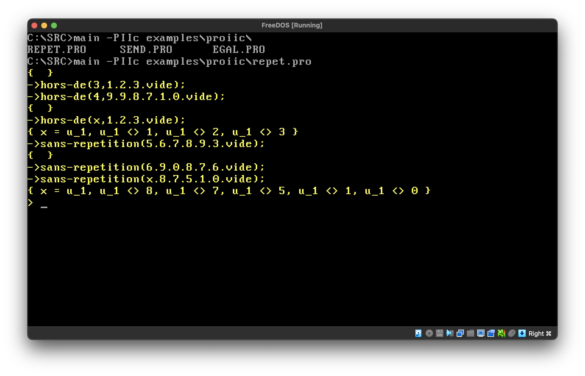
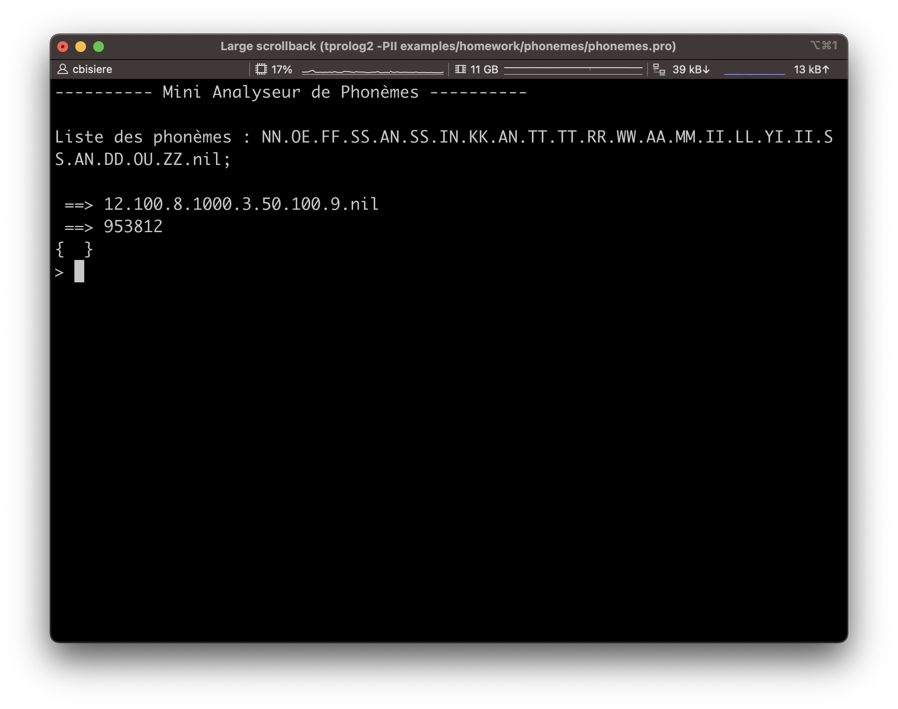
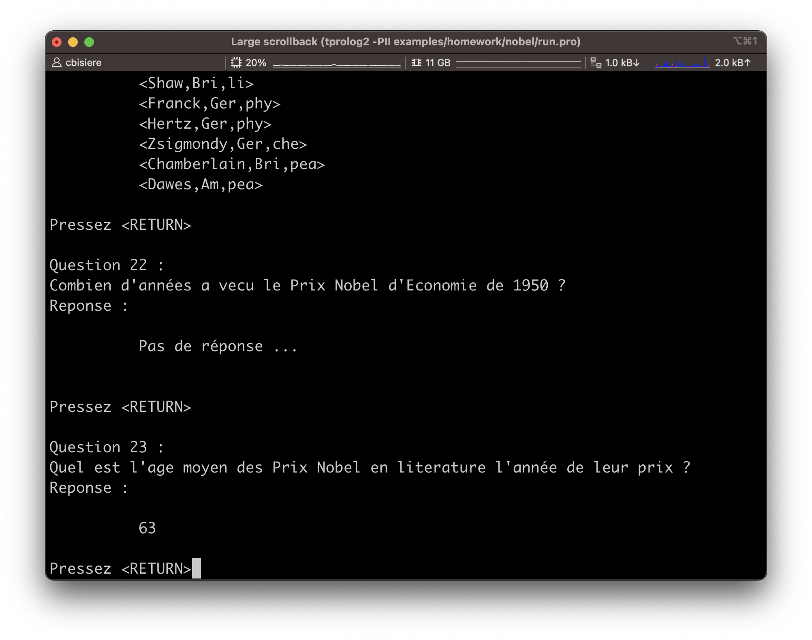

# A Simple Prolog II Interpreter 
A simple Prolog II interpreter written in Pascal

## What?

This is a simple Prolog interpreter, for Linux, macOS, and Windows. It compiles under Turbo Pascal and Free Pascal.

Regarding syntax, it (almost fully) handles the following flavours of the language: Prolog II and Prolog II+. It also supports a "Prolog II with equalities and inequalities" flavour, which was the primary purpose of this interpreter. Edinburgh support just started, and is largely incomplete. 

This whole programme started as an academic exercice, without any consideration for efficiency. In particular, memory consumption is high. Nonetheless, the interpreter is able to solve the "send more money" classical exercice in a low-end computer.

## Why?
2022 is [the 50th anniversary of Prolog](http://prologyear.logicprogramming.org/). As a modest tribute for this anniversary, I decided to dig up a Prolog interpreter I wrote almost 35 years ago, clean it a bit, add a few missing features (e.g., the "cut", garbage collection), and push it online. As this program remains a toy program, this serves no real purpose other than to celebrate this anniversary.

I wrote this program as a course assignment, back in 1988, when I was a student at the University of Aix-Marseille II, pursuing a MSc in Computer Science and Mathematics ("Diplôme d'Études Approfondies en Informatique et Mathématique"). The course, entitled "Prolog II", was taught by the late [Alain Colmerauer](https://en.wikipedia.org/wiki/Alain_Colmerauer), creator of the Prolog language.

One of the courses I also took in this MSc was Henri Méloni's course on speech recognition. As my Prolog II interpreter gained additional features, executing the Prolog programs I wrote for this course is now possible.

A more ambitious goal would be to run some of the demo programs written by Alain Colmeraurer (see [Alain Colmerauer's website](http://alain.colmerauer.free.fr/)). This requires the interpreter to support Edinburgh syntax, which is under way.

## References
Basically, the program implements two algorithms described in the following paper: 

* Alain Colmerauer (1984). [Equations and Inequations on Finite and Infinite Trees](https://www.ueda.info.waseda.ac.jp/AITEC_ICOT_ARCHIVES/ICOT/Museum/FGCS/FGCS84en-proc/84eILEC-1.pdf). FGCS 1984: 85-99. 

Here are two additional interesting papers:

+ Alain Colmerauer (1985). [Prolog in 10 Figures](https://dl.acm.org/doi/pdf/10.1145/214956.214958). Communications of the ACM, vol. 28, num. 12, December.

* Philippe Körner et al. (2022). [Fifty Years of Prolog and Beyond](https://www.cambridge.org/core/journals/theory-and-practice-of-logic-programming/article/fifty-years-of-prolog-and-beyond/3A5329B6E3639879301A6D44346FD1DD). Theory and Practice of Logic Programming, 1-83.


## Overview
Being a simple implementation exercice, the interpreter offers only a few built-in functions and no advanced features. 

Nonetheless, the interpreter is fully garbage collected, and has almost no hard-coded limits.

The source code contains detailed comments (though mostly in French) about the implementation (parsing and execution).

### Lists
In Marseille syntax, a dot `.` is used to separate items in a list. For instance, the rules defining the insertion of an element before any item in a list could be written as:

```
insertion(e,x,e.x) ->;
insertion(e,f.x,f.y) -> insertion(e,x,y);
```

Note that variable names (e.g., `e`) start with a single letter, while identifiers (e.g., `insertion` start with at least two letters. Names and identifiers can have any length.

Inserting an element in a list of four items gives three different solutions:

```
-> insertion(0,1.2.nil,x);
{ x = 0.1.2.nil }
{ x = 1.0.2.nil }
{ x = 1.2.0.nil }
```

Edinburgh-style lists are also supported. In PrologII+ mode, both syntaxes  can be mixed, and satisfy the four equivalences listed on page 45 of the Prolog II+ documentation:

```
$ tprolog2 -PIIp
> eq([a|b],a.b);
{  }
> eq([a,b],a.b.nil);
{  }
> eq([a,b,c,d],a.b.c.d.nil);
{  }
> eq([a,b,c|d],a.b.c.d);
{  }
> eq([a,b|c.d.nil],a.[b,c,d]);
{  }
>
```

### Constraints

The interpreter also handles constraints on trees, expressed as equalities (`=`) or inequalities (`<>`). 

For instance, one can write a simple `dif` rule as:

```
dif(x,y) -> { x <> y };
```

Then, the following query gives no results, as there is no `x` satisfying the constraint:

```
-> dif(x,x);
```

while the following query displays the resulting constraints:  

```
-> dif(x,1);
{ x = x_1 , x_1 <> 1 }
```
(Note that the interpreter has created an additional variable `x_1`, and does not try to get rid of it when displaying the resulting constraint set.)

### Strings

Strings are used as values or as comments. They must be double quoted. Inside a string, a double-quote must be doubled as `""`. Backslash `\`is a continuation character. Comments can appear anywhere outside of rules. String can have any length.

Querying the program

```
"This is a comment"

"This is \
another one"

string("Hello, world!")->;
string("They say: ""hello, world!""")->;
string("Pro\
log")->;
```

with the goal `string(s) outml(s) fails;` gives

```
Hello, world!
They say: "hello, world!"
Prolog
```

The primitive `outml(s)` display the string `s` without the surrounding quotes. 

### The "cut"
As in standard Prolog, when a rule containing a cut (`/`) is used to execute a goal, the execution of this cut prunes the search tree, making the search engine forget the other ways of executing that goal.

To illustrate how the cut works, consider the following example, taken from the [Prolog II Reference Manual](https://www.prolog-heritage.org/en/m2.html), Section 2.1, page R2-2:


```
color(red) ->;
color(blue) ->;

size(big) ->;
size(small) ->;

choice1(x.y) -> color(x) size(y);
choice1("that's all") ->;

choice2(x.y) -> ! color(x) size(y);
choice2("that's all") ->;

choice3(x.y) -> color(x) ! size(y);
choice3("that's all") ->;

choice4(x.y) -> color(x) size(y) !;
choice4("that's all") ->;
```

The following executions show that what the engine forgets after executing a cut in a certain rule or query is all the rules having the same head, plus all the rules which could have been used to clear the terms between the start of the rule's body (or the start of the query) and the cut.


```
-> choice1(u);
{ u = red.big }
{ u = red.small }
{ u = blue.big }
{ u = blue.small }
{ u = "that's all" }
-> choice2(u);
{ u = red.big }
{ u = red.small }
{ u = blue.big }
{ u = blue.small }
-> choice3(u);
{ u = red.big }
{ u = red.small }
-> choice4(u) ;
{ u = red.big }
-> choice1(u) !;
{ u = red.big }
```

### Assignments

Identifiers can be assigned using the predicate `assign(i,t)`. The identifier `i` then becomes a global, "static" (resist backtracking) variable, whose value is equal to the term `t`. It can be further reassigned to a different term. Its value can be read using the predicate `val(i,v)`. 

```
-> assign(file_name,"file.txt");
{  }
-> val(file_name,x);
{ x = "file.txt" }
-> assign(file_name,"another_file.txt");
{  }
-> val(file_name,x);
{ x = "another_file.txt" }
>
```
The value of a non assigned identifier is the identifier itself:

```
-> assign(un,1);
{  }
-> val(un,x) val(deux,y);
{ x = 1, y = deux }
>
```

### Evaluable functions

Evaluable functions `add(x,y)`,`sub(x,y)`,`mul(x,y)`,`div(x,y)`, and `inf(x,y)` are recusivelly evaluated when they appear in the first argument of `val`. Arguments `x` and `y ` must evaluate to integer values.

```
-> val(add(123456789,1),x);
{ x = 123456790 }
-> val(sub(9,10),x);
{ x = -1 }
-> val(div(100,9),x);
{ x = 11 }
-> val(inf(10,9),x);
{ x = 0 }
-> val(add(mul(2,add(3,4)),1000),x);
{ x = 1014 }
>
```


## Compilation

### Turbo Pascal

The program was initially developed in [Turbo Pascal 3](https://en.wikipedia.org/wiki/Turbo_Pascal#Version_3) (TP3). Turbo Pascal 3.02A is [provided](https://web.archive.org/web/20101124092418/http://edn.embarcadero.com/article/20792) to the Borland community free of charge, as a [zip file](https://web.archive.org/web/20110815014726/http://altd.embarcadero.com/download/museum/tp302.zip).

I tried to maintain compatibility with TP3. So, no classes, and a few restrictions on the syntax. Workarounds had to be implemented for the most annoying limitations, namely 16-bit integers and 255-char strings. (For now, TP4 is needed as TP3 compilation triggers a memory overflow.)  

You may use a FreeDOS box to install Turbo Pascal 4, edit `src/tprolog2.pas` to replace the compiler directive `{$I FPC.pas}` with `{$I TP4.pas}`, then compile `tprolog2.pas` and run the Prolog interpreter.

### Free Pascal Compiler

To compile the interpreter with the [Free Pascal Compiler](https://en.wikipedia.org/wiki/Free_Pascal) (FPC), compile `src/tprolog2 ` in Turbo Pascal mode:

```bash
$ fpc -Mtp -FE. src/tprolog2.pas
```

## Execution

A Prolog program to execute is a (UTF8 or ISO/IEC 8859-1) text file containing both the program rules and the queries. When using the default syntax, rules must be written using the Marseille syntax. Each query starts with a `->`and ends with a `;`. The end of the text file, or, alternatively, an additional `;`, ends the program. Lines in the input file can have any length.

For instance, the file `examples/ProII/permu.pro` contains four rules and two queries:

```
permutation(nil,nil) ->;
permutation(e.x,z) -> permutation(x,y)
                      insertion(e,y,z);

insertion(e,x,e.x) ->;
insertion(e,f.x,f.y) -> insertion(e,x,y);

-> permutation(1.2.3.nil,x);
-> permutation(3.a.1.b.nil,2.4.c.d.nil);

```
(Note the `nil` has no special meaning in the language. In this example, `nil` is just an identifier used as an end-of-list mark.)

To execute a program stored in a file `$file` use the command line `tprolog2 -$syntax $file` where `$syntax` is one of the four supported language flavours: 

Value of `$syntax` | Prolog flavour
--- | ---
`PII`  | old Marseille syntax with dashes in identifiers
`PIIp` | Prolog II+
`E` | Edinburgh
`PIIc` | Prolog II with equalities and inequalities (Tiny-Prolog specific; default syntax)


Since `PIIc` is the default, the syntax switch can be omitted when running `permu.pro`:

```
$ ./tprolog2 examples/ProII/permu.pro
-> permutation(1.2.3.nil,x);
{ x = 1.2.3.nil }
{ x = 2.1.3.nil }
{ x = 2.3.1.nil }
{ x = 1.3.2.nil }
{ x = 3.1.2.nil }
{ x = 3.2.1.nil }
-> permutation(3.a.1.b.nil,2.4.c.d.nil);
{ a = 2, b = 4, c = 3, d = 1 }
{ a = 2, b = 4, c = 1, d = 3 }
{ a = 4, b = 2, c = 3, d = 1 }
{ a = 4, b = 2, c = 1, d = 3 }
>
```

The final `>`is a prompt, inviting you to type in other queries to execute, e.g.:

```
> permutation(1.2.3.nil,3.x.y.nil);
-> permutation(1.2.3.nil,3.x.y.nil);
{ x = 1, y = 2 }
{ x = 2, y = 1 }
>
```

Predefined commands include `list` to list the current user rules:

```
> list fail;
-> list fail ;
permutation(nil,nil) ->;
permutation(e.x,z) ->
        permutation(x,y)
        insertion(e,y,z);
insertion(e,x,e.x) ->;
insertion(e,f.x,f.y) ->
        insertion(e,x,y);
>
```

and `insert(f)` to insert rules and queries from a file with file path `f`. 

You can navigate into the history of previous queries using the up and down arrow keys.  

When you are done, use `quit` or hit `Ctrl+C` to quit the interpreter.

```
> quit;
-> quit;
Bye!
$
```

## List of predefined predicates

### Session

Predicate | Meaning | Example
--- | --- | ---
`quit` | quit the interpreter | `>quit;`
`list` | display the current rules | `>list;`
`insert(f)` | insert a Prolog file | `>insert("examples/menu.pro");`

### Input and output

Predicate | Meaning | Example
--- | --- | ---
`input_is(f)`| return the current input | `> input_is(f);` `{ f = "console" }`
`input(f)` | set the current input | `>input("infile.txt");`
`close_input` | close the current input |
`close_input(f)` | close input file `f` |
`clear_input` | ignore all remaining characters in the current input line |
`output_is(f)` | return the current output | `> output_is(f);` `{ f = "console" }`
`output(f)` | set the current output | `> output("outfile.txt");`
`close_output` | close the current output |
`close_output(f)` | close output file `f` |
`flush` | flush the output buffer |
`in(t)` | input a term in `t` |
`in_char(c)` | input a character in `c` |
`out(t)` | display term `t` |
`outm(s)` | display string `s` unquoted |
`line ` | line break |
`outl(t)` | display term `t` and then go to next line |
`outml(s)` | display string `s` unquoted and then go to next line |
`page` | go to the next page |
`clear` | clear the screen |

### Assignment and evaluation

Predicate | Meaning | Example
--- | --- | ---
`assign(i,t)` | assign identifier `i` with term `t` |
`val(t1,t2)` | evaluate expression `t1` and unify the rresult with term `t2` | 

### Equations and inequations

Predicate | Meaning | Example
--- | --- | ---
`eq(x,y)` | unify `x` and `y` |
`dif(x,y)` | add the constraint that `x` is different from `y` |

### Debug

Predicate | Meaning | Example
--- | --- | ---
`bt` | display a backtrace of the current choice points |
`dump` | display information about the state of the Prolog engine |


## BNF Syntax

We describe the different syntaxes handled by the interpreter using [Extended  Backus–Naur form](https://en.wikipedia.org/wiki/Extended_Backus%E2%80%93Naur_form) notation.

### Base elements

All the syntax flavours handled by the interpreter share the following definitions:

```
letter = "A"|...|"Z"|"a"|...|"z"|"À" ... "ß" - "×" | "à" ... "ÿ" - "÷" ;
digit = "0"|...|"9" ;
q = """ ;

digits = digit, {digit} ;
letters = letter, {letter} ;

integer = ["-"], digits ;

string = q, { (character - q - newline) | (q, q) | ("\", newline) }, q ;

constant = identifier | integer | string ;
```

### Marseille syntax

Both Prolog II and Prolog II+ are based on the so-called "Marseille syntax", featuring the famous `->` symbol for rules, dotted lists, and tuples.

```
term = simple-term, { ".", term } ;

simple-term = constant |
              variable  |
              identifier, "(", term-list, ")" |
              tuple |
              "(", term, ")" ;       

term-list = term, { ",", term } ;

tuple = "<", [term-list], ">" ;

cut = "/" ;

rule = term, "->", { term | cut }, ";" ;

query = "->", { term | cut }, ";" ;                                

comment = string ;

program = { comment | rule | query }, [";"] ;

```

### Prolog II

The "old" Prolog II syntax uses Marseille syntax, allowing for dashes in identifiers. 

Unsurprisingly, this possibility had to be reversed in a later version, called _Prolog II+_, to allows for arithmetic expressions. For instance, `x1-y2` is a valid name for a _single_ variable in Prolog II, which would create ambiguities if arithmetic expressions were to be allowed. 

The Prolog II syntax is described in these two books (still on my bookshelf): 

* Francis Giannesini, Henry Kanoui, Robert Pasero, and Michel Van Caneghem, _Prolog_, InterÉditions, 1985. 
* Michel Van Caneghem, _L'Anatomie de Prolog_, InterÉditions, 1986. 

During my graduation year, in 1987-1988, I guess I did all my Prolog programming homework using the MS-DOS implementation of Prolog II. IIRC we had access to SunOS workstations. A version of Prolog might have been available on these machines, but I just do not remember.

To be able to run the Prolog programs I wrote during the academic year, the Tiny Prolog interpreter must fully support the Prolog II syntax.

As mentioned, the most peculiar part of the Prolog II syntax concerns variable names and identifiers. Variables start with a single letter, while identifiers start with at least two letters. 

It also must be noted that even if the two books listed above define letters as 7-bit ASCII lowercase and uppercase letters only, one of the homework exercices I had to do (i.e., Nobel Prizes) happens to use dash-in-identifiers syntax (so, typical Prolog II) while some identifiers do contain accented characters. So I guess I used a version of Prolog II (predating II+) accepting accented letters. I am assuming that the set of letters in this hypothetical Prolog II version is the same as in Prolog II+.

```
variable = short-word, { "-", word } ;

identifier = long-word, { "-", word } ;

word = short-word | long-word ;

short-word = letter, { digit }, { "'" } ;

long-word = letter, word ;
```


### Tiny Prolog

This Prolog is based on the Prolog II syntax above, and adds optional contraints to rules and queries:

```
constraint = term, ("=" | "<>"), term ;          

system = "{", constraint, { ",", constraint }, "}" ;                         

rule = term, "->", { term | cut }, [system], ";" ;

query = "->", { term | cut }, [system], ";" ;

```

### Prolog II+

Prolog II+ does not allow for dashes in variable names or identifiers. Variables start with a `_` or with a single letter. The cut is `!` instead of `/`, the former being reserved for calls to external procedures (a.k.a. _parasites_, e.g. `/?20001`). Tuples gain an alternative syntax: `<>(t1,...tn)`. Finally, both dot and Edinburgh-style lists are supported in Prolog II+ mode, and can be mixed.

```
alpha = letter | digit | "_" ;

variable = ("_" , { alpha }) | extended_var ;

extended_var = letter, [ (digit | "_"), { alpha } ] , { "'" } ;

cut = "!" ;

tuple = "<", [term-list], ">" | "<", ">", "(", term-list, ")" ;

list-expr = term, ["," , list-expr] | 
            term, "|", term ;

list = "[", list-expr, "]" | "[]"

```
where `list` is an additional `simple-term` (see subsection "Marseille Syntax" above).

### Edinburgh

In Edinburgh mode, variable names start with a `_` or with an uppercase letter. Syntax for rules and queries also differ from Prolog II+.

For now, the Edinburgh parser only supports the following part of the syntax:

```
big-letter = "A"|...|"Z" ;

extended-var = big-letter, [ { alpha } ] ;

sq = "'" ;

quoted-identifier = sq, { (character - sq - newline) | (sq, sq) | ("\", newline) }, sq ;

rule = term, [ ":-", term {",", term} ], "." ;

query = ":-", term {",", term}, "."

```
where `quoted-identifier` is an additional form of `identifier`.

A predefined predicate `true` is available in Edinburgh mode.

## Screenshots

_11 June 2023:_ [repet.pro](examples/ProIIc/repet.pro), one of the original demo Prolog programs written for the interpreter back in 1988, running in a FreeDOS box with the new interpreter compiled with Turbo Pascal 4: 



_11 June 2023:_ [phonemes.pro](examples/homework/phonemes/phonemes.pro), a homework Prolog II program written for Henri Méloni's course on speech recognition:



_11 June 2023:_ [nobel.pro](examples/homework/nobel/nobel.pro), a homework Prolog II program. I do not remember the course, though:



## Author

* [Christophe Bisière](https://github.com/cbisiere)

## License

This project is licensed under the MIT License - see the [LICENSE.md](LICENSE.md) file for details
